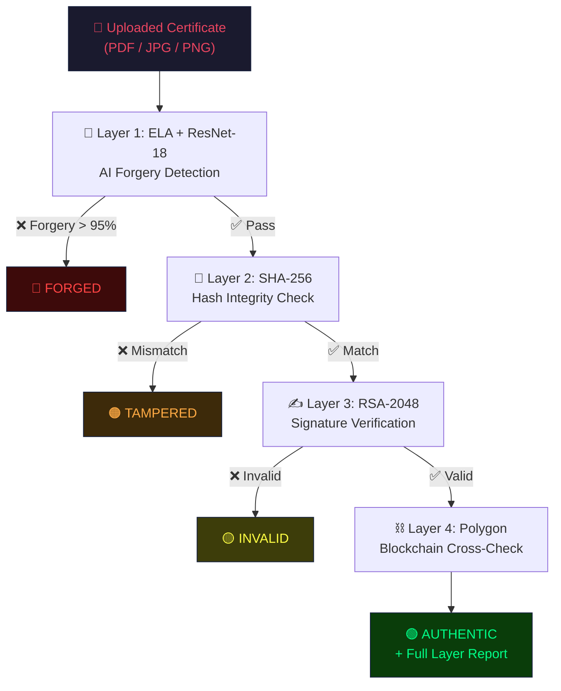

<p align="center">
  
</p>

<h1 align="center">🛡️ CertVerify</h1>
<h3 align="center">Tamper-Proof Academic Credential Verification System</h3>

<p align="center">
  
  
  
  
  
  
  
</p>

<p align="center">
  A multi-layered defense system combining <b>AI forgery detection</b>, <b>cryptographic integrity</b>, and <b>blockchain anchoring</b> to verify academic credentials — built as a Major Project.
</p>

---

## 📋 Table of Contents

- [Overview](#-overview)
- [Key Features](#-key-features)
- [Architecture](#-architecture)
- [Tech Stack](#-tech-stack)
- [Getting Started](#-getting-started)
- [Smart Contract](#-smart-contract)
- [API Reference](#-api-reference)
- [ML Model Performance](#-ml-model-performance)
- [Project Structure](#-project-structure)
- [Contributors](#-contributors)
- [References](#-references)
- [License](#-license)

---

## 🔍 Overview

Academic credential fraud is a growing problem. Traditional verification systems rely on a single mechanism, leaving critical blind spots. **CertVerify** introduces a **defense-in-depth** strategy with four sequential verification layers:

| Layer | Technology | What It Catches |
|:---:|:---|:---|
| 🧠 **1** | ELA + ResNet-18 (AI) | Visually forged/manipulated documents |
| 🔐 **2** | SHA-256 Hash Integrity | Post-issuance file tampering |
| ✍️ **3** | RSA-2048 Digital Signature | Unauthorized certificate generation |
| ⛓️ **4** | Polygon Blockchain Anchor | Database tampering & audit trail |

> **The pipeline fails fast** — if Layer 1 detects forgery with high confidence, subsequent layers are skipped to save compute.

---

## ✨ Key Features

- **🤖 AI-Powered Forgery Detection** — Error Level Analysis (ELA) + fine-tuned ResNet-18 trained on CASIA v2.0 (94.67% accuracy)
- **🔒 Cryptographic Security** — SHA-256 hashing + RSA-2048 digital signatures for every certificate
- **⛓️ Blockchain Immutability** — Certificate hashes anchored on Polygon Amoy for tamper-proof audit trail
- **📱 QR Code Verification** — Instant verification via scannable QR codes embedded in certificates
- **🎓 Role-Based Access** — Separate flows for institutions (issue) and verifiers (verify)
- **📊 Verification History** — Complete audit log of all verification attempts
- **🌐 Modern UI** — Dark-themed, responsive React dashboard with real-time status updates

---

## 🏗️ Architecture



---

## 🛠️ Tech Stack

<table>
<tr>
<td width="50%">

### Backend
| Technology | Purpose |
|:---|:---|
| Python 3.11 | Core language |
| FastAPI | REST API framework |
| SQLAlchemy + SQLite | Database ORM |
| JWT + BCrypt | Authentication |
| RSA (cryptography) | Digital signatures |
| SHA-256 (hashlib) | File integrity |

</td>
<td width="50%">

### Frontend
| Technology | Purpose |
|:---|:---|
| React 18 | UI framework |
| TypeScript | Type safety |
| Vite 5 | Build tool |
| Tailwind CSS | Styling |
| shadcn/ui | Component library |
| Axios | HTTP client |

</td>
</tr>
<tr>
<td>

### ML / AI
| Technology | Purpose |
|:---|:---|
| PyTorch | Deep learning |
| ResNet-18 | CNN backbone |
| OpenCV + Pillow | Image processing |
| ELA | Forgery preprocessing |

</td>
<td>

### Blockchain
| Technology | Purpose |
|:---|:---|
| Solidity 0.8.0 | Smart contract |
| Web3.py | Chain interaction |
| Polygon Amoy | Testnet network |
| py-solc-x | Compiler |

</td>
</tr>
</table>

---

## 🚀 Getting Started

### Prerequisites

| Requirement | Version |
|:---|:---|
| Python | 3.9 or higher |
| Node.js | 18 or higher |
| Git | Latest |

### 1️⃣ Clone the Repository

```bash
git clone https://github.com/shashankayush772/CertVerify.git
cd CertVerify
```

### 2️⃣ Backend Setup

```bash
# Install Python dependencies
pip install -r requirements.txt

# Start the backend server
python -m uvicorn backend.main:app --reload --host 127.0.0.1 --port 8000
```

> The ML model will download automatically on first startup (~85 MB).

### 3️⃣ Frontend Setup

```bash
cd frontend
npm install
npm run dev
```

> Frontend runs at **http://localhost:8080**

### 4️⃣ Environment Variables

Create a `.env` file in the project root:

```env
# ── Core Config ──
CERTVERIFY_PUBLIC_API=http://127.0.0.1:8000
CERTVERIFY_QR_BASE_URL=http://localhost:8080
CERTVERIFY_FRONTEND_ORIGINS=http://localhost:8080,http://127.0.0.1:8080
CERTVERIFY_SECRET_KEY=your-secret-key-change-in-production

# ── Blockchain (optional — leave empty to disable) ──
CERTVERIFY_ALCHEMY_URL=https://rpc-amoy.polygon.technology/
CERTVERIFY_CONTRACT_ADDRESS=
CERTVERIFY_PRIVATE_KEY=
CERTVERIFY_WALLET_ADDRESS=
```

### 5️⃣ Blockchain Setup (Optional)

To enable on-chain certificate anchoring:

```bash
# Deploy the smart contract (generates wallet + deploys)
python tools/deploy_contract.py

# Fund your wallet with testnet POL from:
# https://faucet.polygon.technology/ (select Amoy network)

# Run deploy again after funding
python tools/deploy_contract.py
```

### 🎯 Quick Start (TL;DR)

```bash
# Terminal 1 — Backend
pip install -r requirements.txt
python -m uvicorn backend.main:app --reload --port 8000

# Terminal 2 — Frontend
cd frontend && npm install && npm run dev

# Open http://localhost:8080
```

---

## ⛓️ Smart Contract

**Network:** Polygon Amoy Testnet (Chain ID: 80002)  
**Language:** Solidity 0.8.0  
**Source:** [`contracts/CertRegistry.sol`](contracts/CertRegistry.sol)

| Function | Type | Description |
|:---|:---|:---|
| `storeHash(certId, hash)` | Write | Anchor certificate hash on-chain |
| `getHash(certId)` | Read | Retrieve stored hash |
| `certExists(certId)` | Read | Check if certificate is anchored |
| `getTimestamp(certId)` | Read | Get anchoring timestamp |
| `revokeHash(certId)` | Write | Revoke a certificate (owner only) |

---

## 📡 API Reference

| Method | Endpoint | Description | Auth |
|:---:|:---|:---|:---:|
| `POST` | `/auth/register` | Register institution/verifier | ❌ |
| `POST` | `/auth/token` | Login → JWT token | ❌ |
| `POST` | `/certificates` | Issue a certificate | 🔐 |
| `GET` | `/certificates/my` | List your certificates | 🔐 |
| `POST` | `/verify/upload` | Verify by file upload | ❌ |
| `GET` | `/verify/{cert_id}` | Verify by certificate ID | ❌ |
| `GET` | `/verifications/my` | Your verification history | 🔐 |
| `GET` | `/health` | Service health check | ❌ |

> 📖 **Interactive Docs:** `http://localhost:8000/docs` (Swagger UI)

---

## 📊 ML Model Performance

**Dataset:** CASIA v2.0 (12,614 images — 7,491 authentic + 5,123 tampered)  
**Model:** ResNet-18 (ImageNet pretrained, fine-tuned)  
**Training:** 15 epochs, Adam (`lr=0.0005`), CosineAnnealingLR

| Metric | Score |
|:---|:---:|
| **Accuracy** | 94.67% |
| **Precision** | 95.64% |
| **Recall** | 93.60% |
| **F1-Score** | 94.61% |

---

## 📁 Project Structure

```
CertVerify/
├── 🔧 backend/
│   ├── main.py              # FastAPI application & routes
│   ├── auth.py              # JWT authentication & registration
│   ├── blockchain.py        # Polygon Amoy blockchain client
│   ├── database.py          # SQLAlchemy models & migrations
│   ├── hashing.py           # SHA-256 & RSA operations
│   ├── models.py            # Database models
│   ├── schemas.py           # Pydantic request/response schemas
│   ├── qr.py                # QR code generation
│   └── ml/
│       ├── ela.py            # Error Level Analysis preprocessing
│       ├── predict.py        # ResNet-18 inference pipeline
│       └── train.py          # Model training script
│
├── ⛓️ contracts/
│   └── CertRegistry.sol      # Solidity smart contract
│
├── 🎨 frontend/
│   └── src/
│       ├── components/        # React UI components
│       ├── contexts/          # Auth context provider
│       ├── pages/             # Route pages
│       └── lib/               # Utilities & API helpers
│
├── 🔨 tools/
│   └── deploy_contract.py     # Blockchain deployment script
│
├── .env                       # Environment config (not committed)
├── requirements.txt           # Python dependencies
└── README.md                  # You are here!
```

---

## 📚 References

> Literature survey entries used to motivate CertVerify design decisions.

1. N. Ch *et al.*, "Deep learning-based document forgery detection with constrained training data," *IJISAE*, vol. 12, no. 3, 2024.
2. S. R. Babu *et al.*, "Blockchain and hash-based certificate verification framework," *Proc. ICSCSE*, 2022.
3. J. Vidal *et al.*, "Blockchain-based academic certificate management: integrity and revocation challenges," *Proc. IEEE EDUCON*, 2020.
4. J. Dong *et al.*, "CASIA image tampering detection evaluation database," *Proc. IEEE ChinaSIP*, 2013.
5. H. Farid, "Image forgery detection: A survey," *IEEE Signal Processing Magazine*, 2009.
6. M. C. Stamm *et al.*, "Information forensics: An overview of the first decade," *IEEE Access*, 2013.

---

## 👥 Contributors

<table>
  <tr>
    <td align="center">
      <a href="https://github.com/shashankayush772">
        
        <br /><sub><b>Shashank Ayush</b></sub>
      </a>
    </td>
    <td align="center">
      <a href="https://github.com/algovista97">
        
        <br /><sub><b>Sai Bilvanath</b></sub>
      </a>
    </td>
  </tr>
</table>

---

## 📄 License

This project is developed as an **academic major project** and research implementation.  
For production or institutional adoption, perform a security review, key management hardening, and infrastructure-level compliance checks.

---

<p align="center">
  Built with ❤️ using Python, React, PyTorch & Solidity
</p>
